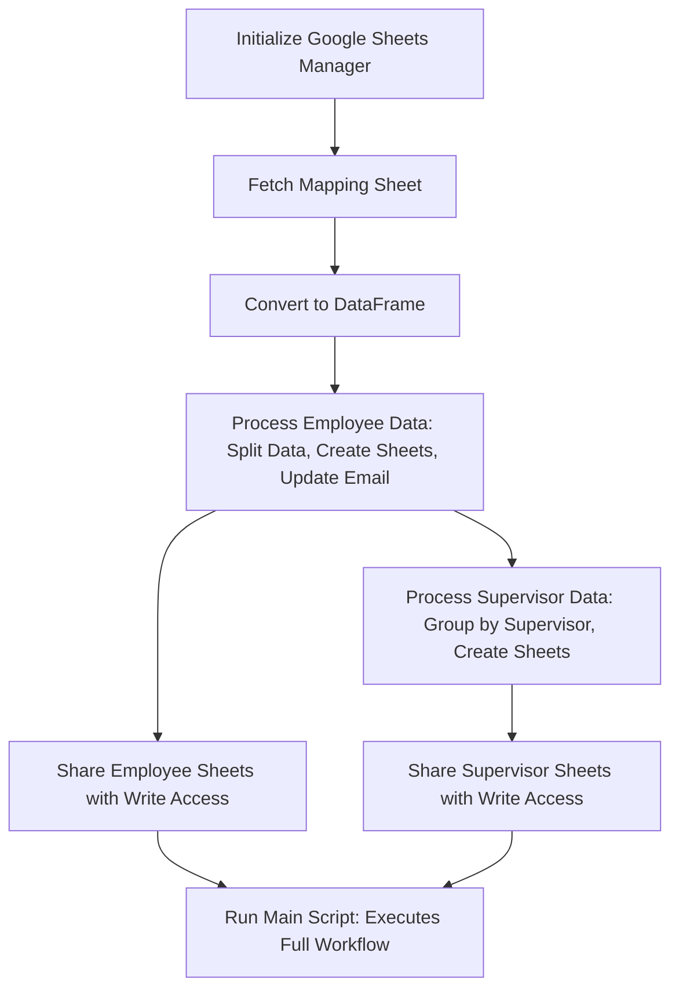

# Google Sheet Automation Project

## Overview

This project automates the process of managing employee and supervisor-related Google Sheets. It creates new sheets for each employee and supervisor, populates them with relevant data, and shares them with the respective users. The project uses the **Google Sheets API** and **Google Drive API** to manage sheet creation, updates, and sharing.Sheets Management Project

## Step-by-Step Workflow

1. **Initialize Google Sheet Manager**:
   - Load service account credentials from `service_account.json`.
   - Authenticate and initialize Google Sheets API client.

2. **Fetch Mapping Sheet**:
   - Retrieve the mapping sheet specified by the `.env` variable `MAPPING_SHEET`.
   - Convert it into a DataFrame using `pandas`.

3. **Process Employee Data**:
   - Split the employee data based on the `Direct Reports` column.
   - Create separate sheets for each employee by duplicating a template.
   - Update the employee sheet with the employee's email in a specific tab.

4. **Process Supervisor Data**:
   - Group employees by supervisors.
   - Create a combined sheet for each supervisor by duplicating a template.
   - Update the supervisor's sheet with the emails of the employees under their supervision.

5. **Share Sheets**:
   - Share the newly created sheets with the respective employees and supervisors, granting them `writer` access.

6. **Run the Main Script**:
   - The script reads from the mapping sheet and performs all the operations in sequence.
---


## Prerequisites

### 1. Python Version

-   Python version: **Python 3.12.3**
-   Required Packages: See the `requirements.txt` section below.

### 2. Install Python

-   Download and install Python from the [Python Release Python 3.12.3 | Python.org](https://www.python.org/downloads/release/python-3123/).
    
-   Verify the installation by running:
    
    ```bash
    python --version
    ```
    

### 3. Install Virtual Environment (venv)

-   Create a virtual environment for the project using `venv`:
    
    ```bash
    python -m venv venv
    ```
    
-   Activate the virtual environment:
    
    -   On Windows:
        
        ```bash
        venv\Scripts\activate
        ```
        
    -   On macOS/Linux:
		 ```bash
		source venv/bin/activate
		```
### 4. Clone the Repository
- Clone the project repository to your local machine:

	```bash
	git clone https://github.com/STT-121/Grubhub-Reporting.git 
	cd Grubhub-Reporting
	```
### 2. Install Required Python Packages

-   With the virtual environment activated, install the dependencies using `pip`:
    `pip install -r requirements.txt` 
    

### 3. Create `.env` File

-   The project requires environment variables to configure Google Sheets and Drive integration.
    
-   Create a `.env` file in the root directory with the following variables:
    ```
    MAPPING_SHEET='Mapping Sheet Name'
    EMPLOYEE_TEMPLATE='Template Sheet ID for Employees'
    SUPERVISOR_TEMPLATE='Template Sheet ID for Supervisors'
    ``` 
    

### **Environment Variables Description**

-   `MAPPING_SHEET`: The name of the tab in `GH Sample Data` sheet that contains the mapping of employees and supervisors.
-   `EMPLOYEE_TEMPLATE`: The Sheet ID of the template sheet that will be used to create employee sheets.
-   `SUPERVISOR_TEMPLATE`: The Sheet ID of the template sheet that will be used to create supervisor sheets.

### 4. Create `service_account.json` for Google Sheets API

To use the Google Sheets and Google Drive API, you will need a service account and a credentials JSON file.

### Steps to Create `service_account.json`:

1.  Go to the Google Cloud Console.
2.  Create a new project or select an existing one.
3.  Enable **Google Sheets API** and **Google Drive API** for the project:
    -   Navigate to **APIs & Services** > **Library** and search for the APIs.
    -   Click on **Enable** for both APIs.
4.  Create a **service account**:
    -   Navigate to **APIs & Services** > **Credentials** > **Create Credentials** > **Service Account**.
    -   Assign roles like **Editor** or **Viewer** as per your needs.
5.  Download the **JSON** key for the service account:
    -   Once the service account is created, click on it and navigate to the **Keys** section.
    -   Click on **Add Key** > **Create New Key**, select **JSON**, and save the file as `service_account.json` in your project root directory.

### Important:

Ensure the Google Sheets you want to access are shared with the service account's email address (found in the `service_account.json` file).

----------

## Running the Project

1.  Activate the virtual environment:
    
    -   On Windows:
        `venv\Scripts\activate` 
        
    -   On macOS/Linux:
        `source venv/bin/activate` 
        
2.  Run the project:    
    `python main.py`

## Project Structure

```
.
├── main.py                   # Main script to run the project
├── google_sheets.py           # Contains GoogleSheetManager class to manage Google Sheets and Drive
├── custom_functions.py        # Utility functions for processing employee and supervisor data
├── service_account.json       # Google Cloud Service Account credentials
├── .env                       # Environment variables for the project
├── requirements.txt           # Python dependencies

```
----------
## Conclusion

After setting up your virtual environment, installing the dependencies, and configuring the `.env` and `service_account.json` files, you can run the project to automate Google Sheet creation and sharing.

Make sure you follow the steps carefully to avoid any issues with Google API authentication and sheet manipulation.
